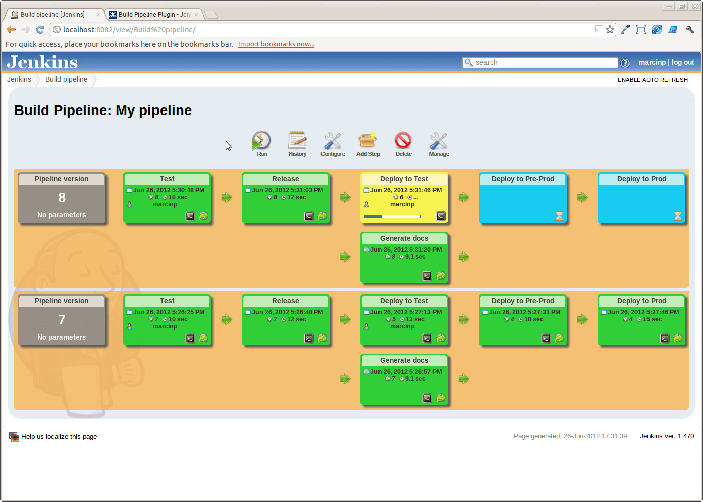
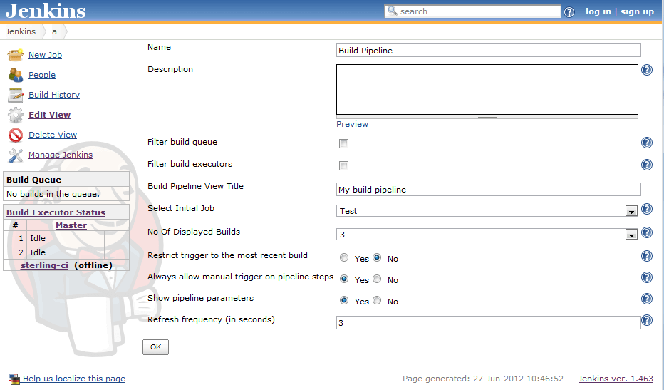
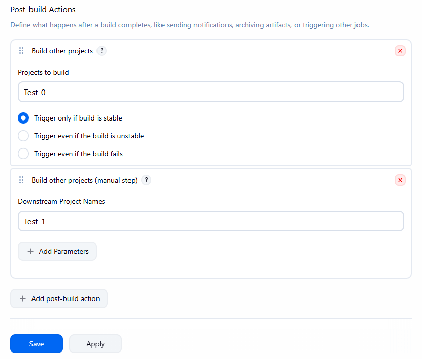

# Build Pipeline Plugin

This plugin provides a *Build Pipeline View* of upstream and downstream connected jobs that typically
form a build pipeline.  In addition, it offers the ability to define manual triggers for jobs that
require intervention prior to execution (e.g., an approval process outside of Jenkins).

## Overview

Continuous Integration has become a widely adopted practice in modern software development.  Jenkins
is a great tool for Continuous Integration.

**Taking it to the next level**: Continuous Integration can become the centerpiece of your
[deployment pipeline](http://www.informit.com/articles/article.aspx?p=1621865), orchestrating the promotion
of a version of software through quality gates and into production.  By extending the concepts of CI
you can create a chain of jobs, each one subjecting your build to quality assurance steps.  These
QA steps may be a combination of manual and automated steps.  Once a build has passed all of these,
it can be automatically deployed into production.

In order to better support this process, we have developed the Build Pipeline Plugin.  This gives
the ability to form a chain of jobs based on their upstream and downstream dependencies.  Downstream
jobs may, as per the default behaviors, be triggered automatically, or by a suitable authorized user
manually triggering it.

You can also see a history of pipelines in a view, the current status, and where each version got to
in the chain based on it revision number in VCS.

### Screenshots

#### The Pipeline View

## Configuration

### View Configuration

1. Install the plugin using the Jenkins Plugin Manager and restart.
2. Create a view of the new type, *Build Pipeline View*.  You will then be redirected directly to the
configuration page.
3. The table below outlines each interesting parameters controls:

| Parameter                                          | Description                                                                                                                                                            |
|----------------------------------------------------|------------------------------------------------------------------------------------------------------------------------------------------------------------------------|
| Name                                               | The name of the Build Pipeline View                                                                                                                                    |
| Description                                        | This message will be displayed on the view page. Useful for describing what this view is about, or linking to relevant resources. Can contain HTML tags.               |
| Build Pipeline View Title                          | Gives a title to the page that displays the view                                                                                                                       |
| Select Initial Job                                 | This is the first job in the build pipeline. It will traverse through the downstream jobs to build up the entire build pipeline. Select from a drop-down list of jobs. |
| No of Displayed Builds                             | The number of historical builds to be displayed on a page.                                                                                                             |
| Restrict triggers to most recent successful builds | Select this option to restrict the display of a Trigger button to only the most recent successful build pipelines.                                                     |
| Always allow manual trigger on pipeline steps      | Select this option if you want to manually execute or re-execute any step of the pipeline at any time.                                                                 |
| Show pipeline parameters                           | Select this option if you want to display the parameters used to run the first job in the pipeline.                                                                    |

The configuration page looks like this:

### Job Configuration

1. Navigate to the Job Configuration page.
2. Scroll down to the *Post-build Actions* section.
	1. For an **Automated** downstream build step: To add a build step that will trigger automatically upon
	the successful completion of the previous one:
		1. Select the *Build other projects* check-box.
		2. Enter the name(s) of the downstream projects in the *Projects to build* field. (n.b. Multiple
		projects can be specified by using comma, like "abc, def".).
	2. For a *Manually Triggered* downstream build step: To add a build step that will wait for a manual
	trigger:
		1. Select the *Build Pipeline Plugin -\> Manually Execution Downstream Project* check-box.
		2. Enter the name(s) of the downstream projects in the *Downstream Project Names* field.  (n.b.
		Multiple projects can be specified by using comma, like "abc, def".).
3. Click *Save*.

### Automatic & Manual Downstream Build Steps

The **Build Pipeline Plugin** handles the creation of multiple automatic or manually triggered downstream
build steps on the same project.

### Upgrading from Release 1.0.0

When upgrading from 1.0.0 to 1.1.x some of the previous view and job configuration fields have been
removed.  You may notice some errors appearing in the Jenkins log:

> WARNING: Skipping a non-existent field downstreamProjectName com.thoughtworks.xstream.converters.reflection.NonExistentFieldException:
No such field
au.com.centrumsystems.hudson.plugin.buildpipeline.trigger.BuildPipelineTrigger.downstreamProjectName

This is because the configuration files refer to old fields that may no longer exist.  In order to
correct these issues, go to the Job Configuration page, confirm that all of the details are correct,
and click on the *Save* button.

## Changelog in [GitHub Releases](https://github.com/jenkinsci/build-pipeline-plugin/releases)

Release notes have been recorded in [GitHub Releases](https://github.com/jenkinsci/build-pipeline-plugin/releases) since Build Pipeline plugin 2.0.0.
Prior release notes are recorded in the archived [changelog](https://github.com/jenkinsci/build-pipeline-plugin/blob/build-pipeline-plugin-2.0.0/CHANGELOG.md)
